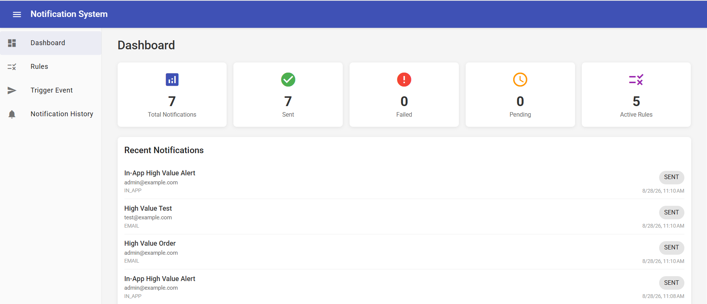
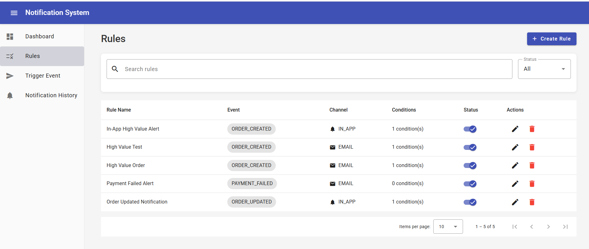
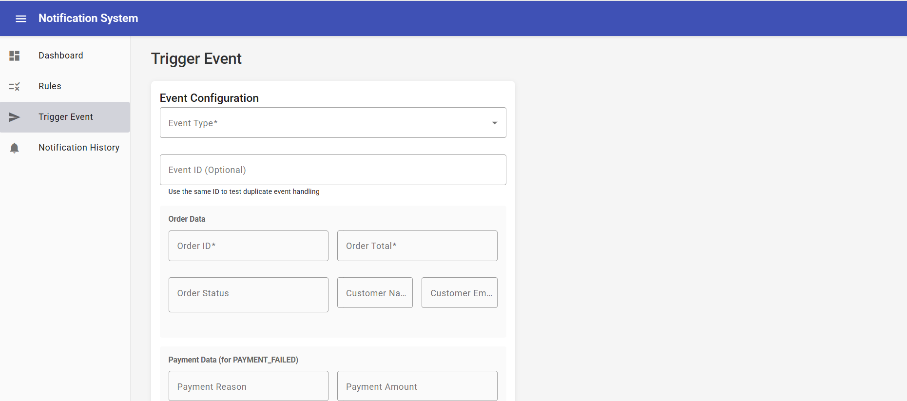
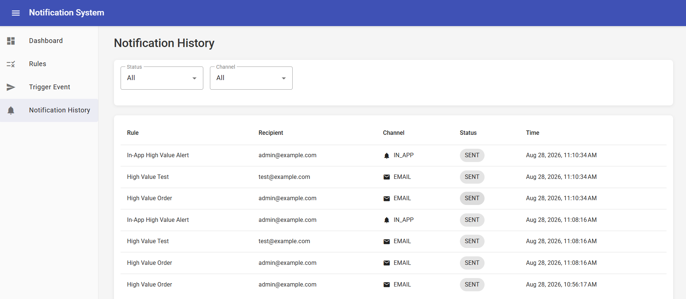

# Configurable Notification System

A production-quality, configurable notification system built with Angular 21, Node.js/Express, TypeScript, and MongoDB.

Users can define notification rules that specify when they want to receive notifications, which events trigger them, what conditions must be met, who receives them, which channel to use, and what message template to send.

---

## Features

- **Rule Management** - Full CRUD for notification rules with dynamic condition builder
- **Event Processing** - Trigger events that automatically evaluate matching rules
- **Condition Engine** - Support for 6 operators (`EQUALS`, `NOT_EQUALS`, `GREATER_THAN`, `LESS_THAN`, `GREATER_THAN_OR_EQUAL`, `LESS_THAN_OR_EQUAL`) with nested field access and AND semantics
- **Template Engine** - Mustache-style placeholders with nested field support (`{{order.id}}`)
- **Notification Channels** - Strategy pattern abstraction with Email (mocked) and In-App channels
- **Idempotency** - Duplicate event detection prevents duplicate notifications
- **Notification History** - Full history with pagination, filtering by status and channel
- **Dashboard** - Stats overview and recent notifications
- **Responsive UI** - Professional Angular Material dashboard
- **Validation & Error Handling** - Centralized validation and consistent API error responses
- **Extensible Architecture** - New notification channels can be added with minimal changes

---

## Screenshots

### Dashboard

The dashboard provides an overview of notification activity, including statistics and recent notifications.



---

### Rule Management

The Rules page allows users to search, filter, enable/disable, edit, and delete notification rules.



---

### Create / Edit Rule

Users can configure the event, recipients, notification channel, conditions, and message template.



---

### Event Processing

The event processing screen demonstrates the complete notification workflow, including matched rules, generated notifications, and delivery status.



---

## Architecture

```text
Angular 21 Frontend
        |
        v
REST API (Express.js)
        |
        v
Rule Engine
        |
        +---> Condition Evaluator (pure functions, fully testable)
        |
        +---> Template Service (pure function, fully testable)
        |
        v
Channel Factory (Strategy Pattern)
        |
        +---> EmailChannel (mocked provider)
        |
        +---> InAppChannel (persists to MongoDB)
        |
        v
MongoDB (Mongoose ODM)